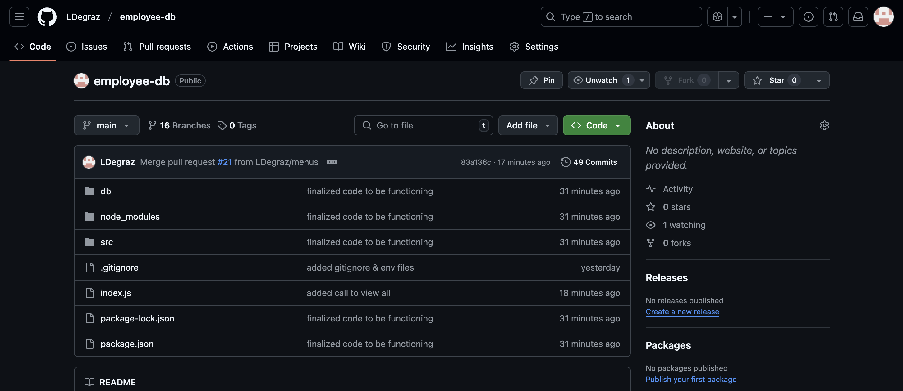
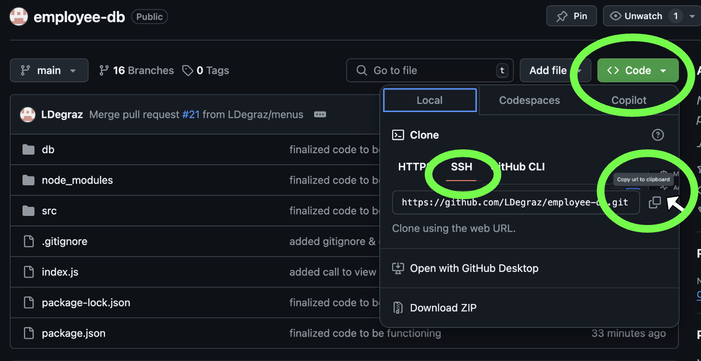
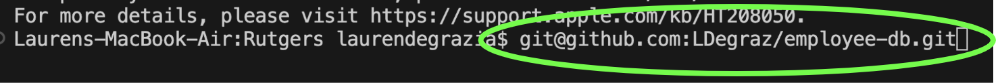
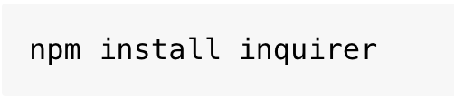
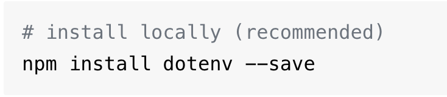
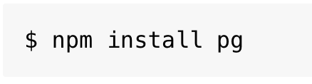
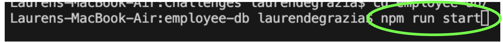
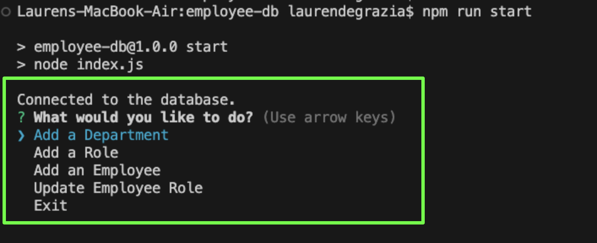
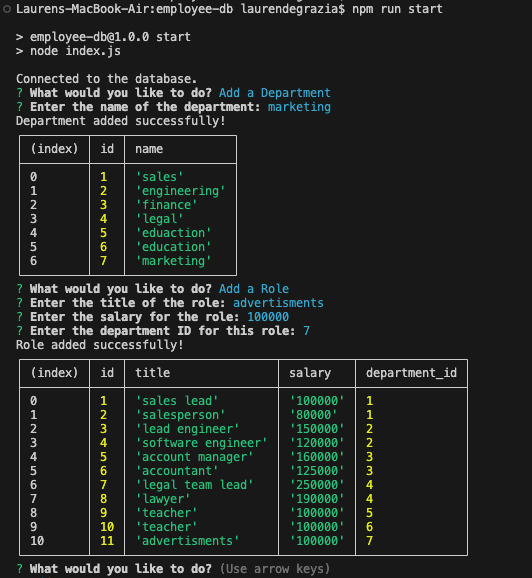

# Employee Manager Database
## Description
**Thanks for choosing Employee Manager Database** This application will help keep your employee details organized for quick reference!

## Table of Contents
- [Installation](#installation)
- [Usage](#usage)
- [Contributors](#contributors)
- [License](#license)
- [Questions](#questions)

## Installation
To install this application, please follow the steps below:

1. **Prerequisites:** Please be sure to have the following installed:
- [Node.js](https://nodejs.or/)
- [npm](https://www.npmjs.com/) Node package manager, comes with Node.js

2. **Go to Employee Manager Database repo:**
- [Click here for Employee Manager Database Repo](https://github.com/LDegraz/employee-db.git)

   

3. **Copy SSH Key & Clone Repo:**
- Click "code" & copy the SSH key to your clipboard

   

- Go to your local code editor (VS-Code) & paste the SSH key after the command: git clone

   

- Navigate to the project directory using the command: cd employee-db

   

4. **Install Dependencies:**
- **Note: Please be sure you installed the prerequisites in step 1. You will need npm installed for this step**
- Use the commands below to install the required npm packages: Inquirer, dotenv, & pg

   
   
   

5. **Run the Application:**
- Start the Employee Manager Database by typing the following command in your terminal: npm run start

   

## Usage
[Click here to watch a short video demonstrating how to use the application](https://drive.google.com/file/d/16l-kQPBHA2wEJWGnT4J3RuzAUIdbLuPS/view)

To create your employee database, follow these steps:
1. Complete the steps above (Installation section) & run the application with the command: npm run start

   

2. Follow the prompts
- You will use the arrow key to highlight the section & press return/enter.

   

3. View the information
- After making your edits, press return/enter to see the updated information in the terminal.  

   

## Contributors
- [Lauren DeGrazia](https://github.com/LDegraz/employee-db.git) - Project Creator
- [Inquirer](https://www.npmjs.com/package/inquirer) - A collection of common interactive command-line user interfaces
- [pg](https://www.npmjs.com/package/pg) - A PostgreSQL client for Node.js.
- [Inquirer](https://www.npmjs.com/package/dotenv) - A zero-dependency module that loads environment variables from a .env file into process.env.
- Xpert Learning Assistant - The AI Learning Assistant for support and guidance throughout the bootcamp.
- Lesley Vaden - T.A., providing guidance and support throughout the assignment. 
- Kevin Ferguson: Instructor, providing guidance and support throughout the assignment.
- Andres - Tutor from Rutgers Bootcamp, providing additional help and support for the assignment.

## License
This project is licensed under the MIT license. See below for details.

### MIT License

MIT License

Copyright (c) [2025] [Lauren DeGrazia]

Permission is hereby granted, free of charge, to any person obtaining a copy
of this software and associated documentation files (the "Software"), to deal
in the Software without restriction, including without limitation the rights
to use, copy, modify, merge, publish, distribute, sublicense, and/or sell
copies of the Software, and to permit persons to whom the Software is
furnished to do so, subject to the following conditions:

The above copyright notice and this permission notice shall be included in all
copies or substantial portions of the Software.

THE SOFTWARE IS PROVIDED "AS IS", WITHOUT WARRANTY OF ANY KIND, EXPRESS OR
IMPLIED, INCLUDING BUT NOT LIMITED TO THE WARRANTIES OF MERCHANTABILITY,
FITNESS FOR A PARTICULAR PURPOSE AND NONINFRINGEMENT. IN NO EVENT SHALL THE
AUTHORS OR COPYRIGHT HOLDERS BE LIABLE FOR ANY CLAIM, DAMAGES OR OTHER
LIABILITY, WHETHER IN AN ACTION OF CONTRACT, TORT OR OTHERWISE, ARISING FROM,
OUT OF OR IN CONNECTION WITH THE SOFTWARE OR THE USE OR OTHER DEALINGS IN THE
SOFTWARE.

## Questions
If you have any questions, feel free to reach out!
- **GitHub:** [LDeGraz](https://github.com/LDegraz)
- **Email:** [degrazial3@gmail.com](mailto:degrazial3@gmail.com)

### How to Contact
You can contact me via email for any inquiries or feedback regarding this project. Alternatively, you can open an issue on GitHub if you encounter any problems or have suggestions for improvements. I will do my best to respond promptly!

